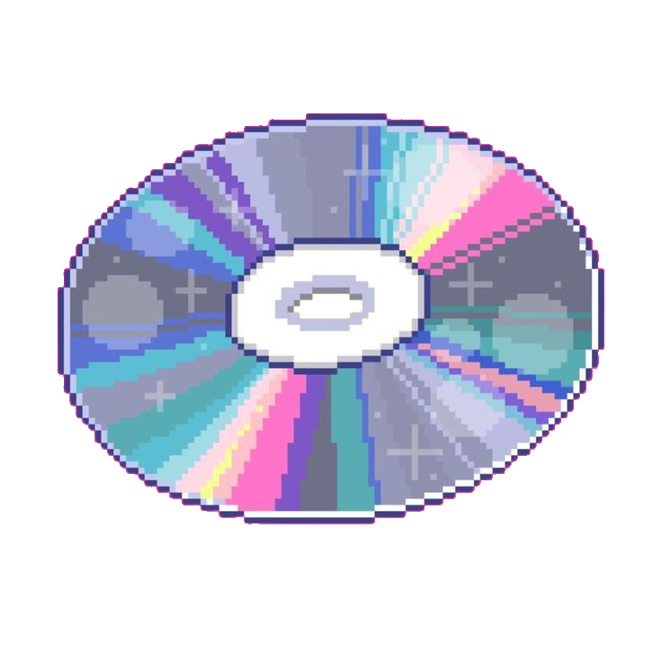

<div align="center">

</div>

<div align="center">
Hi! This is where I keep my Strudel Live Patches: A personal archive of studies, ideas and noisy experiments in live-coded music. ✦
</div>

---

##  REPOSITORY STRUCTURE

Here’s how everything is organized.  
Each `songX.md` is a Strudel (strudel.cc) code experiment you can copy and run.

```
STRUDEL-PATCHES/
├── assets/
│   └── banner.png
├── README.md
├── song1.md
├── song2.md
├── song3.md
├── song4.md
└── song5.md
```
---

##  HOW TO RUN THE CODE

To listen to any patch, just follow these steps.  

### 1. Copy the code  
Open any `.md` file (ex: `song1.md`) and copy everything.

### 2. Open the Strudel REPL  
Official Strudel editor:  
🔗 https://strudel.cc/

### 3. Paste and run  
- Delete any code already in the editor.  
- Paste the code you copied.  
- To run:

**Windows/Linux:** `Ctrl + Enter`  
**Mac:** `Cmd + Enter`  

The sound starts instantly!  
To stop, click **Ctrl + .** at the top of the screen.

---
### Sthefany Alves ✦  
